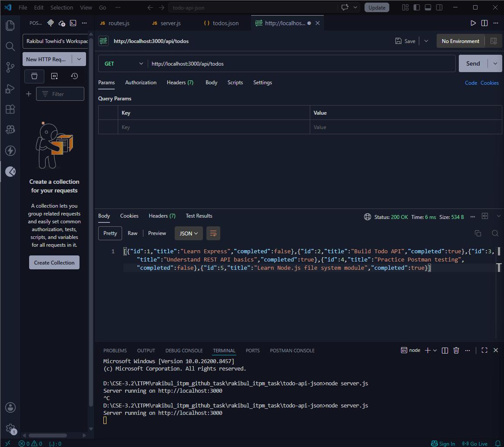
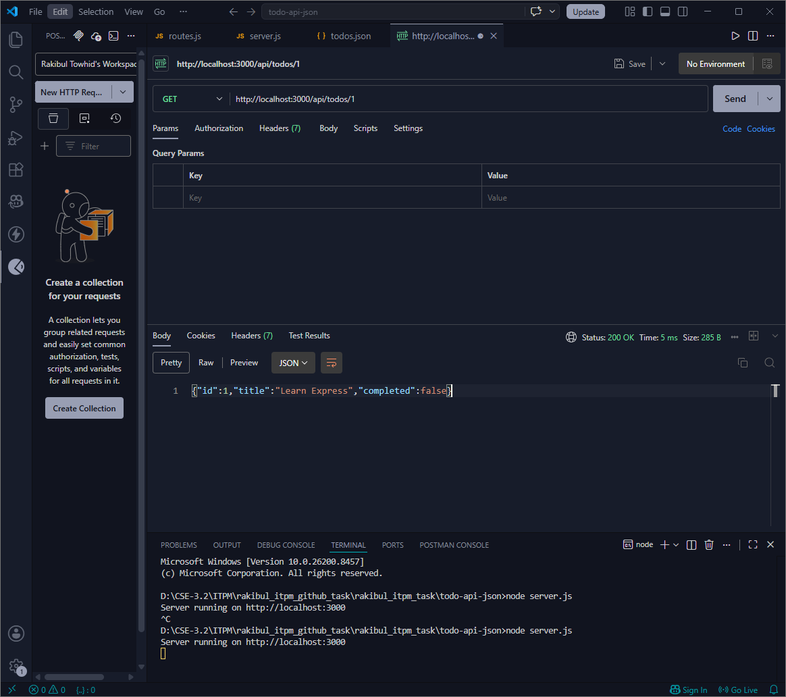
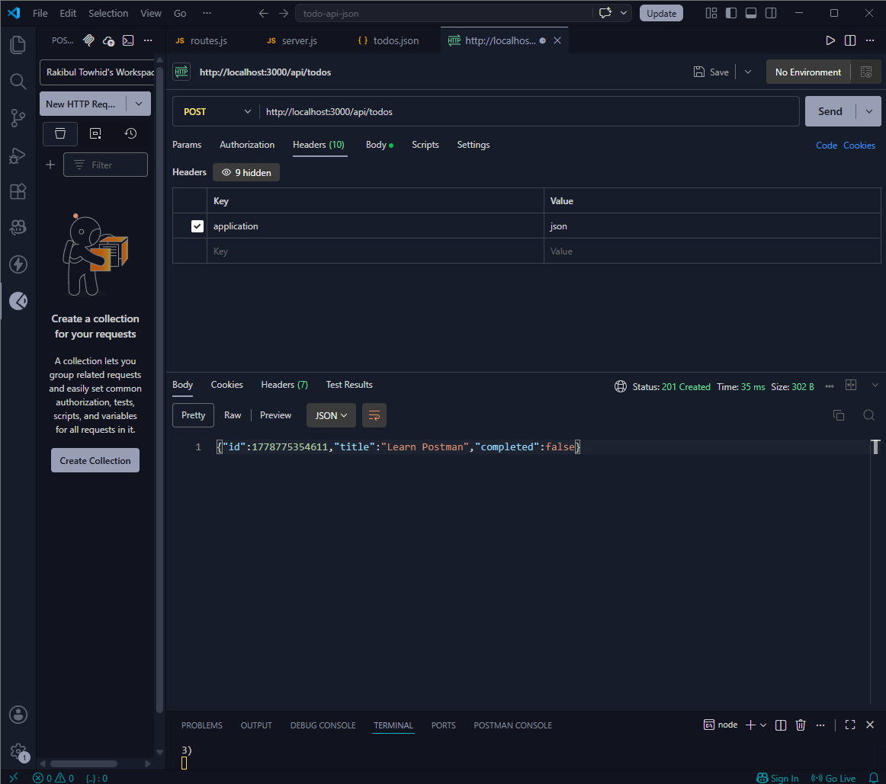
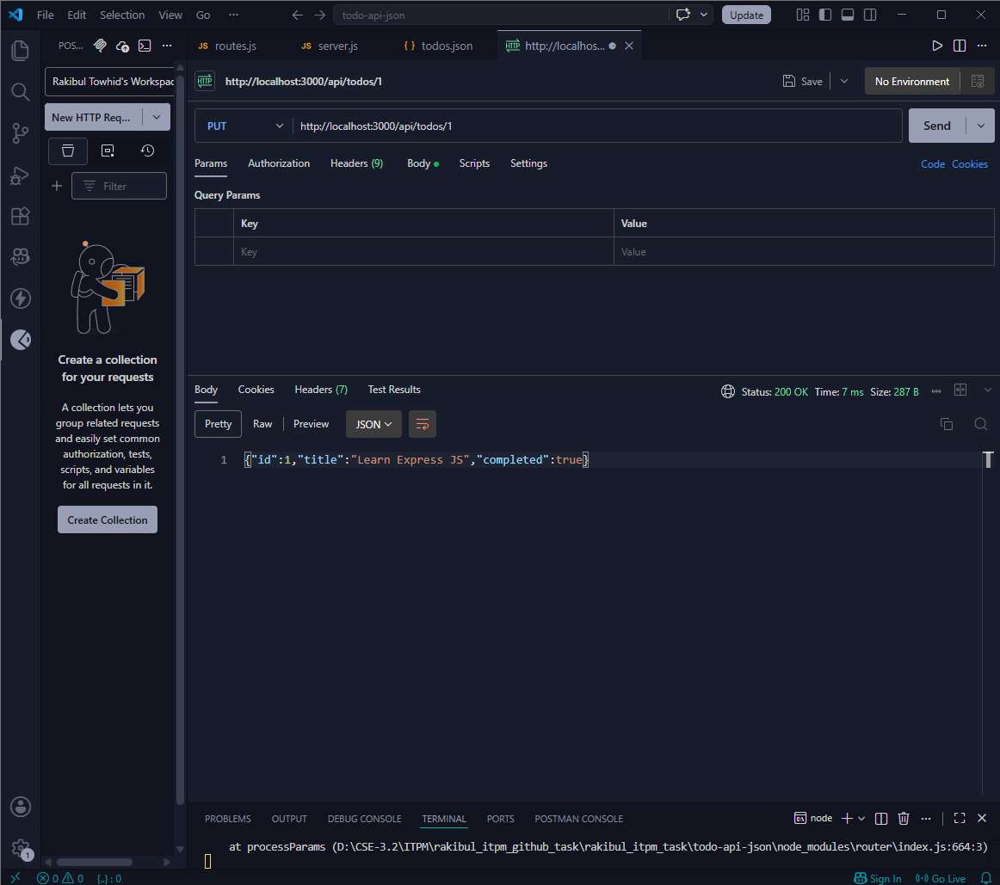
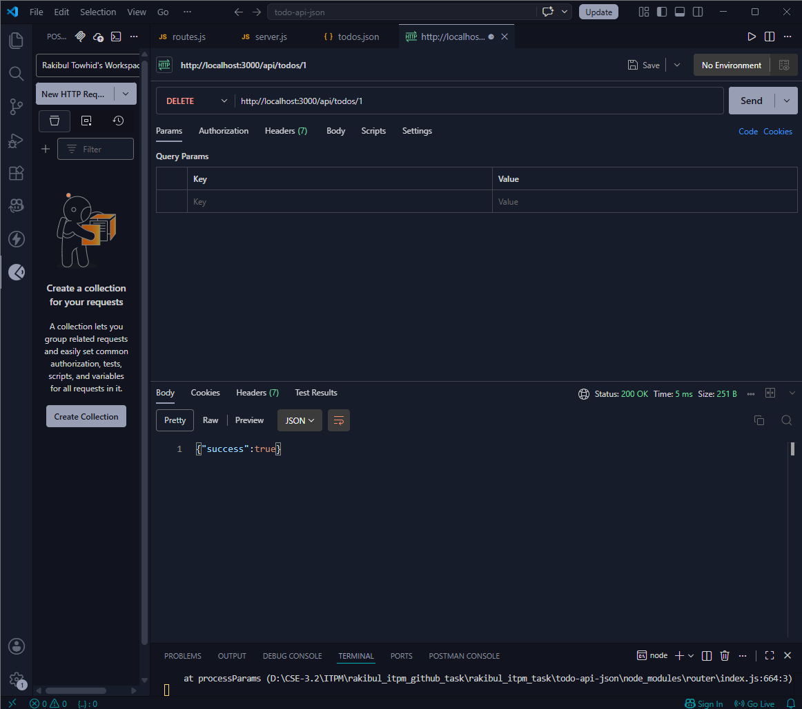
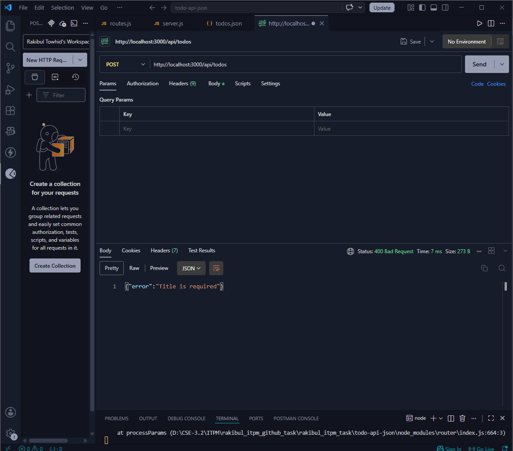
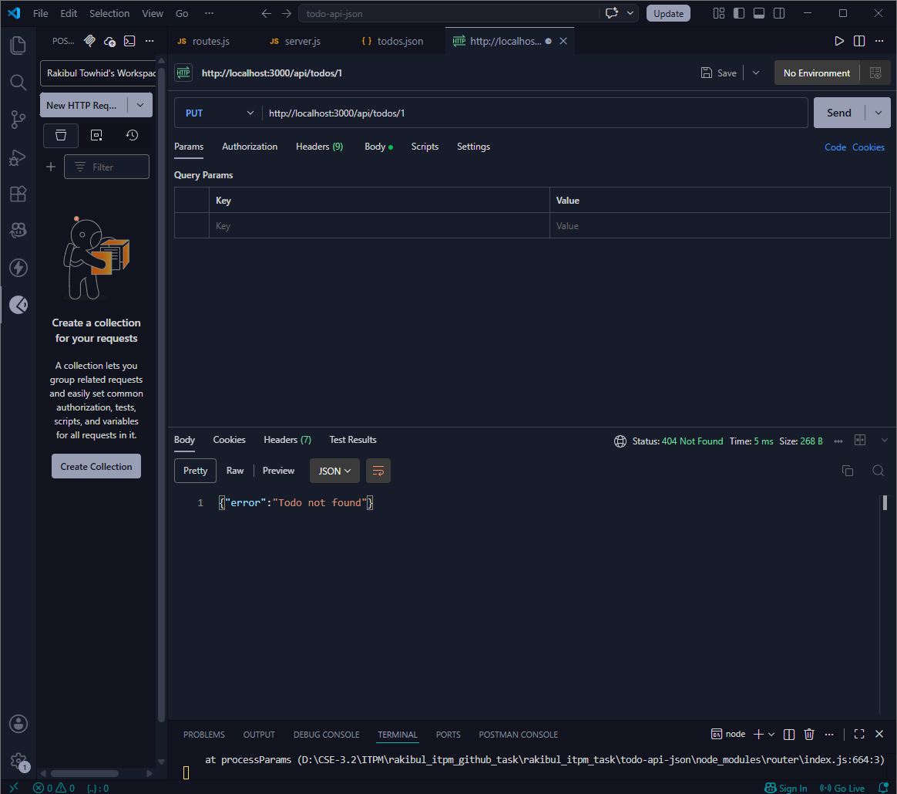

# Todo API

A simple RESTful Todo API built with **Node.js** and **Express.js**, using a JSON file as a lightweight database. No external database required.

---

## Tech Stack

- Node.js
- Express.js
- File System (`fs`) module — JSON file as data store

---

## Project Structure

```
todo-api/
├── routes/
│   └── routes.js
├── todos.json
├── server.js
└── package.json
```

---

## Getting Started

### 1. Clone the repository

```bash
git clone https://github.com/your-username/your-repo-name.git
cd your-repo-name
```

### 2. Install dependencies

```bash
npm install
```

### 3. Run the server

```bash
node server.js
```

Server will start at: `http://localhost:3000`

---

## API Endpoints

Base URL: `http://localhost:3000/api/todos`

| Method | Endpoint         | Description          |
|--------|------------------|----------------------|
| GET    | `/api/todos`     | Get all todos        |
| GET    | `/api/todos/:id` | Get a single todo    |
| POST   | `/api/todos`     | Create a new todo    |
| PUT    | `/api/todos/:id` | Update a todo        |
| DELETE | `/api/todos/:id` | Delete a todo        |

---

## API Testing (Postman)

All endpoints were tested using Postman. Screenshots of each test are included below.

---

### 1. GET All Todos

**Method:** `GET`  
**URL:** `http://localhost:3000/api/todos`

**Response:**
```json
[
  {
    "id": 2,
    "title": "Build Todo API",
    "completed": true
  },
  ...
]
```



---

### 2. GET Single Todo

**Method:** `GET`  
**URL:** `http://localhost:3000/api/todos/:id`

**Response:**
```json
{
  "id": 2,
  "title": "Build Todo API",
  "completed": true
}
```



---

### 3. CREATE Todo

**Method:** `POST`  
**URL:** `http://localhost:3000/api/todos`  
**Header:** `Content-Type: application/json`

**Request Body:**
```json
{
  "title": "Learn Postman"
}
```

**Response:**
```json
{
  "id": 1778775354611,
  "title": "Learn Postman",
  "completed": false
}
```



---

### 4. UPDATE Todo

**Method:** `PUT`  
**URL:** `http://localhost:3000/api/todos/:id`  
**Header:** `Content-Type: application/json`

**Request Body:**
```json
{
  "title": "Learn Express JS",
  "completed": true
}
```

**Response:**
```json
{
  "id": 1,
  "title": "Learn Express JS",
  "completed": true
}
```



---

### 5. DELETE Todo

**Method:** `DELETE`  
**URL:** `http://localhost:3000/api/todos/:id`

**Response:**
```json
{
  "success": true
}
```



---

### 6. Error — Empty Title

**Method:** `POST`  
**URL:** `http://localhost:3000/api/todos`

**Request Body:**
```json
{
  "title": ""
}
```

**Response:**
```json
{
  "error": "Title is required"
}
```



---

### 7. Error — Invalid Boolean

**Method:** `PUT`  
**URL:** `http://localhost:3000/api/todos/:id`

**Request Body:**
```json
{
  "completed": "yes"
}
```

**Response:**
```json
{
  "error": "Completed must be boolean"
}
```



---

## Notes

- Screenshots are stored in the `testing_screenshots/` folder, named `1.png` through `7.png`.
- The `todos.json` file acts as the database and updates automatically on every create, update, or delete operation.
- No external database setup is needed.